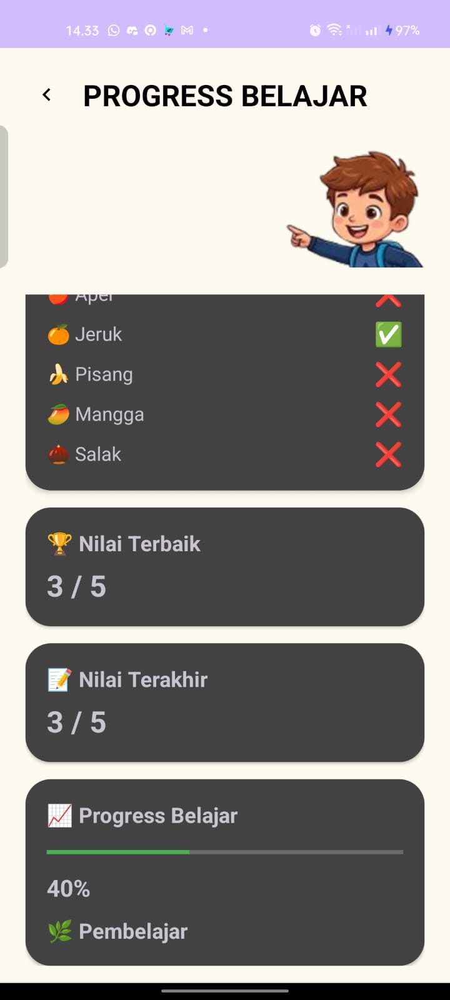

# 📱 SiBISA (Sistem Belajar Bahasa Isyarat)

SiBISA merupakan aplikasi mobile berbasis Android yang dirancang untuk membantu anak-anak mengenal Bahasa Isyarat Indonesia (BISINDO) melalui teknologi Augmented Reality (AR). Aplikasi ini dikembangkan sebagai proyek mata kuliah Pemrograman Android.

---

## 📖 Deskripsi

SiBISA menghadirkan media pembelajaran interaktif yang menggabungkan materi pembelajaran, kuis, dan teknologi Augmented Reality sehingga proses belajar menjadi lebih menarik dan mudah dipahami.

---

## ✨ Fitur

- 📚 Materi Pembelajaran
- 🥭 Fakta Buah
- ❓ Kuis Interaktif
- 📈 Progress Belajar
- 🥇 Sistem Badge
- 🥽 Augmented Reality (Unity + AR Foundation)
- ℹ️ Halaman Tentang

---

## 🛠 Teknologi

- Java
- Android Studio
- Unity
- AR Foundation
- ARCore
- SharedPreferences
- ConstraintLayout

---

## 📷 Screenshot

Contoh:

| Home | Kuis | Progress |
|------|------|----------|
|  |  |  |

---

## 📂 Struktur Project

```
SIBISA/
│
├── app/
├── unityLibrary/
├── shared/
├── gradle/
└── README.md
```

---

## 🚀 Cara Menjalankan

1. Clone repository

```bash
git clone https://github.com/rifqyfakhryzain/Sibisa.git
```

2. Buka menggunakan Android Studio.

3. Sync Gradle.

4. Jalankan aplikasi pada perangkat yang mendukung ARCore.

---

## 👨‍💻 Tim Pengembang

- Eflin Christian Hutapea
- Ihsan Rizky Muharrom
- Rifqy Fakhry Zain
- Muhammad Shahril Ramdan
- Ayudia Afina

---

## 📄 Lisensi

Project ini dibuat untuk keperluan akademik di Universitas Komputer Indonesia (UNIKOM).
